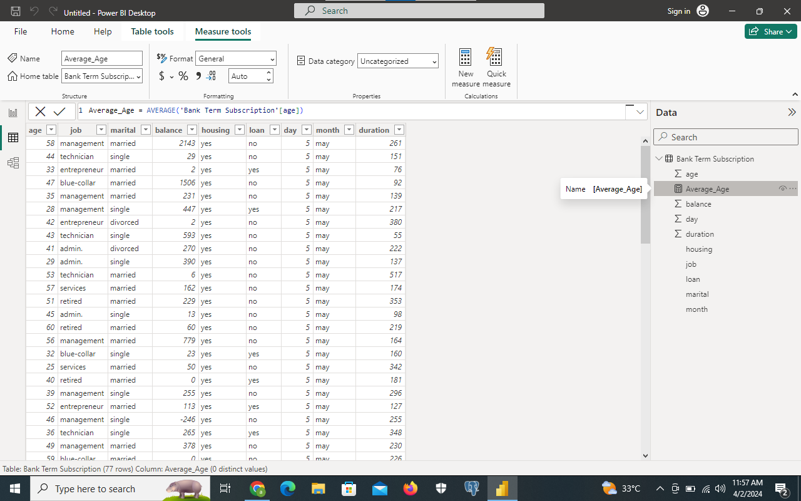

# Introduction
In this Project, I used Dax functions to get some information about the dataset. The bank_term_subcription dataset contains data that shows the bank information, it includes customer name, thier balance,job, marital status and other information that helps us understand every customer and thier banking details.

# Problem Statement
Using the ‘Bank Term Deposit Subscription’ dataset provided, carryout the following
1) Create a measure for the ‘Average age of depositors’
2) Create a new column named ‘Age band’ containing the following;
‘Young’ for ages below 30
‘Mid-aged’ for ages between 30 and 50
‘Old’ for ages above 50
3) Create a measure calculating the total balance for:
Job: Technician
Marital: Single and Married
4) Create a measure to get the number of depositors on Loan

## Task One; Create a measure for the ‘Average age of depositors'
Steps; Click On the Table Tab icon
       On the Table tools tab click on New Measure
       
        
Function Used: Average_Age = AVERAGE(`Bank_Term_Subcription`[age])

The average_ age appears at the data tab by the right hand side of the screen

## Task Two; Create a new column named ‘Age band’ containing the following;
‘Young’ for ages below 30
‘Mid-aged’ for ages between 30 and 50
‘Old’ for ages above 50

Step;  Click On the Table Tab icon
       On the Table tools tab click on New Coloumn
       

Formular Used;Age_Band =IF(`Bank_Term_Subcription[age]`<30, "young", IF(`Bank_Term_Subcription[age]<=50,"Middle_Age",Old_Age"))

## Task Three;Create a measure calculating the total balance for:Job: Technician
 Formular Used: Total_Balance = CALCULATE(SUM('Bank Term Subscription'[balance]),'Bank Term Subscription'[job]="technician")
 
 Marital: Single and Married
 Formular Used;Total_Balance_marital = CALCULATE(SUM('Bank Term Subscription'[balance]),'Bank Term Subscription'[marital]= "single", 'Bank Term Subscription'[marital] = "married")
 

 ## Task Four; Create a measure to get the number of depositors on Loan
 Formular Used; ON_LOAN = CALCULATE(COUNT('Bank Term Subscription'[loan]),'Bank Term Subscription'[loan]="yes")
 

### Thank you for Reading
  
